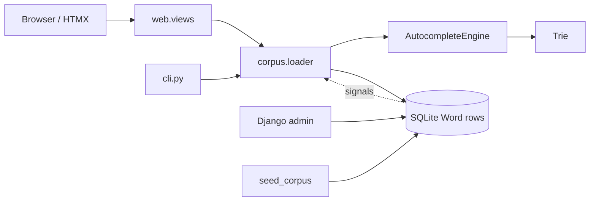
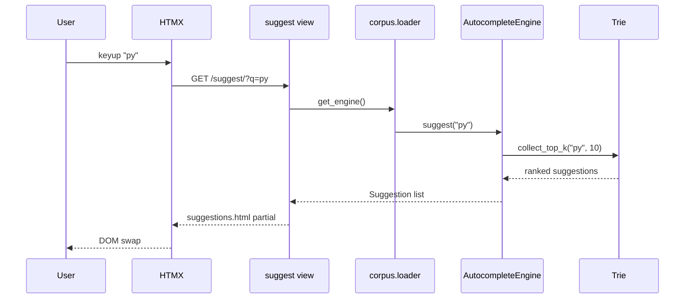

# Architecture

## Problem

Serve ranked prefix suggestions over a searchable corpus with:

- exact, case-insensitive prefix matching
- static weight-based ranking
- safe HTML rendering and a thin web UI

## System map



## Layer responsibilities

| Layer | Role |
| --- | --- |
| `autocomplete/` | Pure Python trie, normalizer, engine. No Django imports. |
| `corpus/` | `Word` model, loader singleton, cache invalidation, management commands. |
| `web/` | GET-only views, HTMX partials, keyboard navigation. |
| `cli.py` | Optional REPL / one-shot queries via Django-backed loader. |

## Request flow (type `py`)



## Dependency direction

```text
web -> corpus.loader -> autocomplete
corpus -> autocomplete
cli -> corpus.loader -> autocomplete
```

See ADRs in [`docs/adr/`](adr/) for trade-offs (singleton engine, cache invalidation, security posture).
